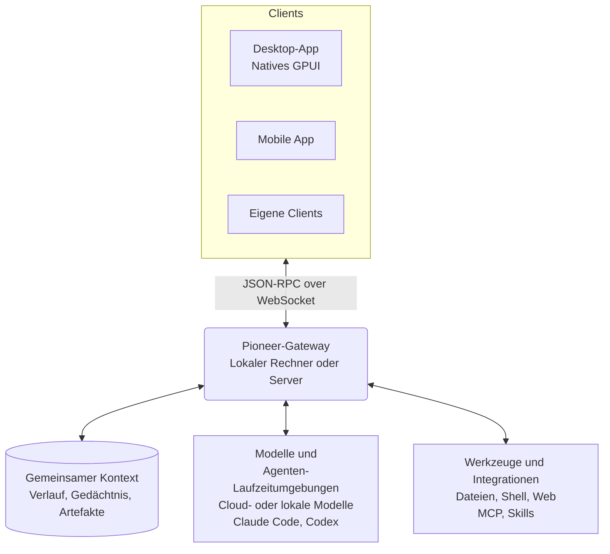

<p align="center">
  
</p>

<h1 align="center">Pioneer</h1>

<p align="center">
  Arbeitsbereiche, in denen Menschen und Agenten zusammenarbeiten und auf gemeinsamem Kontext aufbauen.
</p>

<p align="center">
  <a href="https://github.com/pioneerdotai/pioneer/releases"></a>
  <a href="./LICENSE"></a>
</p>

<p align="center">
  <a href="https://github.com/pioneerdotai/pioneer/releases">Download</a>
  ·
  <a href="https://docs.getpioneer.dev/getting-started/installation">Installation</a>
  ·
  <a href="https://docs.getpioneer.dev/getting-started/quickstart">Schnellstart</a>
  ·
  <a href="https://docs.getpioneer.dev">Dokumentation</a>
  ·
  <a href="https://docs.getpioneer.dev/architecture/overview">Architektur</a>
  ·
  <a href="https://docs.getpioneer.dev/protocol/introduction">Protokollreferenz</a>
</p>

<p align="center">
  <a href="README.md">English</a> · <a href="README.ru.md">Русский</a> · <a href="README.de.md">Deutsch</a> · <a href="README.es.md">Español</a> · <a href="README.fr.md">Français</a> · <a href="README.hi.md">हिन्दी</a> · <a href="README.ja.md">日本語</a> · <a href="README.zh-CN.md">简体中文</a>
</p>

In Pioneer arbeiten Menschen und Agenten im selben Thread. Tauscht euch in einem Thread aus, gebt einem Agenten eine Aufgabe und prüft das Ergebnis im selben Gespräch. Nutzt Pioneer allein, im Team oder mit der Familie.

Nutzt die integrierten Agenten von Pioneer oder verbindet Claude Code und Codex. Pioneer stellt Kontext und Werkzeuge bereit und koordiniert die Aufgaben der Agenten. Es läuft auf eurem Computer oder einem Server, den ihr selbst verwaltet.

<p align="center">
  <picture>
    <source media="(prefers-color-scheme: dark)" srcset="assets/screenshots/pioneer-main-dark.png">
    <source media="(prefers-color-scheme: light)" srcset="assets/screenshots/pioneer-main-light.png">
    
  </picture>
</p>

## Was ihr damit machen könnt

- **Gemeinsam einen Fehler untersuchen.** Teilt eine Fehlermeldung in einem Team-Thread. Lasst einen Agenten Code und Logs prüfen und schaut euch den vorgeschlagenen Fix gemeinsam an.
- **Einen Launch vorbereiten.** Besprecht Zielgruppe und Rahmenbedingungen. Lasst einen Agenten Wettbewerber recherchieren oder Texte entwerfen und gebt anschließend Feedback.
- **Eine Entscheidung nachvollziehen.** Fragt, warum ihr einen bestimmten Ansatz gewählt habt. Ein Agent kann frühere Gespräche durchsuchen und passende Nachrichten und verknüpfte Dateien für seine Antwort nutzen.
- **Familienpläne machen.** Besprecht eine Reise mit der Familie und lasst einen Agenten Optionen anhand eurer gespeicherten Vorlieben vergleichen.

## Funktionen

| Funktion | Was sie ermöglicht |
| --- | --- |
| **Arbeitsbereiche und Threads** | Trennt Projekte und Gruppen. Ladet Menschen ein, tauscht Nachrichten aus und verwaltet den Zugriff auf Arbeitsbereiche und private Threads. |
| **Agenten und Delegation** | Konfiguriert benannte Agenten, führt Aufgaben im Hintergrund aus und lasst Agenten Arbeit an Unteragenten delegieren. Verfolgt den Fortschritt und fordert Überarbeitungen an. |
| **Modelle und Laufzeitumgebungen** | Nutzt Anthropic, OpenAI, Gemini, OpenRouter, Ollama oder einen OpenAI-kompatiblen Endpunkt. Verbindet Claude Code oder Codex auf dem Gateway-Rechner. |
| **Werkzeuge und Skills** | Arbeitet mit Dateien, Shell-Befehlen und dem Web. Verbindet Dienste über [MCP](https://docs.getpioneer.dev/mcp/overview) und hinterlegt wiederverwendbare Anweisungen als [Skills](https://docs.getpioneer.dev/skills/overview). |
| **Geplante Aufgaben** | Richtet einmalige oder wiederkehrende Aufgaben ein und erhaltet die Ergebnisse in einem Thread oder im Aufgaben-Posteingang. |
| **Berechtigungen** | Wählt [Supervised, Auto-accept edits oder Full access](https://docs.getpioneer.dev/getting-started/permissions). Das Gateway setzt Zugriffsregeln und Freigaberichtlinien für Werkzeuge durch. |

## Auf gemeinsamem Kontext aufbauen

Die nächste Aufgabe kann nutzen, was ihr bei der vorherigen erarbeitet habt. Pioneer indexiert den Gesprächsverlauf, merkt sich ausgewählte Fakten und Entscheidungen und verknüpft Dateien mit den Aufgaben, bei denen sie entstanden sind.

Agenten rufen passenden Kontext ab, sofern die Zugriffsrechte für Arbeitsbereiche und Threads es erlauben. Dabei halten sie das festgelegte Kontextbudget ein. Verlauf und Gedächtnis bleiben in Pioneer, unabhängig vom Modellanbieter.

[Gedächtnis](https://docs.getpioneer.dev/desktop/memory) · [Kontextabruf](https://docs.getpioneer.dev/architecture/thread-episodic-context) · [Zusammenarbeit](https://docs.getpioneer.dev/desktop/account-and-collaboration)

## Erste Schritte

[Ladet Pioneer herunter](https://github.com/pioneerdotai/pioneer/releases) für macOS, Windows oder Linux.

1. Öffnet die App und startet das lokale Gateway, wenn ihr dazu aufgefordert werdet, oder verbindet euch mit einem bestehenden Gateway.
2. Wählt einen Arbeitsbereich und verbindet einen Modellanbieter oder eine unterstützte Agenten-Laufzeitumgebung.
3. Erstellt einen Thread. Ladet andere ein, wenn ihr gemeinsam arbeiten möchtet.

[Schnellstart](https://docs.getpioneer.dev/getting-started/quickstart) · [Installation eines entfernten Gateways](https://docs.getpioneer.dev/getting-started/installation)

## Technischer Aufbau

Pioneer ist ein Rust-Workspace mit einer nativen GPUI-Desktop-App und einem Gateway mit SQLite-Datenbank. Clients verbinden sich über eine JSON-RPC-API via WebSocket.



Das Gateway verwaltet den Zustand und führt Modellaufrufe, CLI-Laufzeitumgebungen, Werkzeuge und geplante Aufgaben aus. Ein entferntes Gateway nutzt die Dateien und Ausführungsumgebung des Rechners, auf dem es läuft. Eine Desktop-App kann sich mit mehreren Gateways verbinden.

[Architektur](https://docs.getpioneer.dev/architecture/overview) · [Protokoll](https://docs.getpioneer.dev/protocol/introduction) · [Anbieter](https://docs.getpioneer.dev/providers/overview)

## Aus dem Quellcode bauen

Installiert Rust mit [rustup](https://rustup.rs). Die Toolchain steht in [rust-toolchain.toml](./rust-toolchain.toml), plattformspezifische Abhängigkeiten im [Leitfaden für Mitwirkende](https://docs.getpioneer.dev/contributing).

```bash
git clone https://github.com/pioneerdotai/pioneer.git
cd pioneer
cargo build --workspace
```

Führt diese Befehle in getrennten Terminals aus:

```bash
cargo run -p pioneer-gateway
cargo run -p pioneer-desktop --bin pioneer-app
```

Fehlerberichte und Pull Requests sind willkommen. Die [Dokumentation](https://docs.getpioneer.dev) beschreibt Bedienung, Konfiguration und Architektur.

Pioneer wird aktiv entwickelt. Einige Abläufe sind noch unvollständig, und APIs können sich ändern.

[MIT-Lizenz](./LICENSE)
