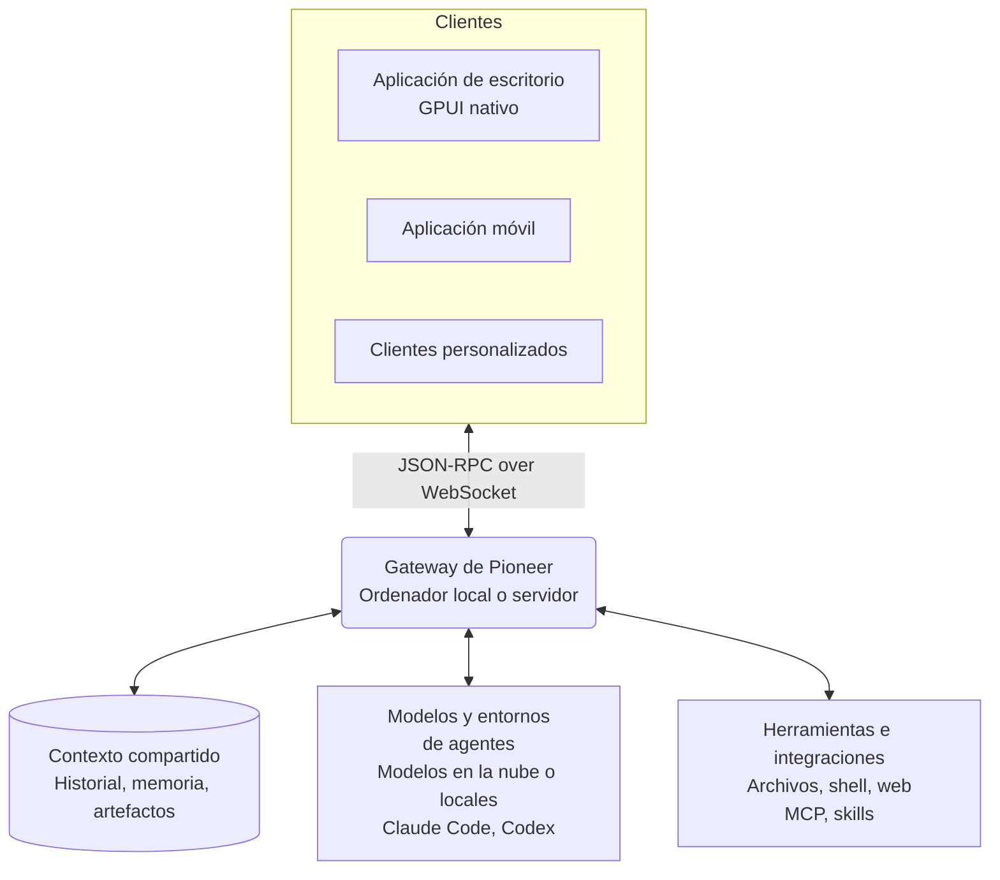

<p align="center">
  
</p>

<h1 align="center">Pioneer</h1>

<p align="center">
  Espacios donde personas y agentes colaboran y avanzan a partir de un contexto compartido.
</p>

<p align="center">
  <a href="https://github.com/pioneerdotai/pioneer/releases"></a>
  <a href="./LICENSE"></a>
</p>

<p align="center">
  <a href="https://github.com/pioneerdotai/pioneer/releases">Descargar</a>
  ·
  <a href="https://docs.getpioneer.dev/getting-started/installation">Instalación</a>
  ·
  <a href="https://docs.getpioneer.dev/getting-started/quickstart">Inicio rápido</a>
  ·
  <a href="https://docs.getpioneer.dev">Documentación</a>
  ·
  <a href="https://docs.getpioneer.dev/architecture/overview">Arquitectura</a>
  ·
  <a href="https://docs.getpioneer.dev/protocol/introduction">Referencia del protocolo</a>
</p>

<p align="center">
  <a href="README.md">English</a> · <a href="README.ru.md">Русский</a> · <a href="README.de.md">Deutsch</a> · <a href="README.es.md">Español</a> · <a href="README.fr.md">Français</a> · <a href="README.hi.md">हिन्दी</a> · <a href="README.ja.md">日本語</a> · <a href="README.zh-CN.md">简体中文</a>
</p>

En Pioneer, puedes encargar tareas a los agentes en el mismo hilo donde las comentas. Conversa en un hilo, asigna una tarea a un agente y revisa el resultado en la misma conversación. Úsalo por tu cuenta, con un equipo o con tu familia.

Usa los agentes integrados de Pioneer o conecta Claude Code y Codex. Pioneer proporciona contexto y herramientas a los agentes y coordina sus tareas. Ejecútalo en tu ordenador o en un servidor que controles.

<p align="center">
  <picture>
    <source media="(prefers-color-scheme: dark)" srcset="assets/screenshots/pioneer-main-dark.png">
    <source media="(prefers-color-scheme: light)" srcset="assets/screenshots/pioneer-main-light.png">
    
  </picture>
</p>

## Qué puedes hacer

- **Investigar un error en equipo.** Comparte un error en un hilo del equipo. Pide a un agente que revise el código y los registros, y revisa la corrección propuesta junto al equipo.
- **Preparar un lanzamiento.** Habla sobre el público y las restricciones. Pide a un agente que investigue a la competencia o redacte textos y después dale tus comentarios.
- **Revisar una decisión anterior.** Pregunta por qué elegiste un enfoque. Un agente puede buscar en conversaciones anteriores y usar los mensajes relevantes y los archivos vinculados en su respuesta.
- **Hacer planes en familia.** Habla de un viaje con tu familia y pide a un agente que compare opciones según tus preferencias guardadas.

## Funciones

| Función | Qué permite hacer |
| --- | --- |
| **Espacios de trabajo e hilos** | Separa proyectos y grupos. Invita a otras personas, intercambia mensajes y controla el acceso a los espacios de trabajo y a los hilos privados. |
| **Agentes y delegación** | Configura agentes con nombre, ejecuta tareas en segundo plano y permite que los agentes deleguen trabajo en subagentes. Revisa el progreso y solicita cambios. |
| **Modelos y entornos de ejecución** | Usa Anthropic, OpenAI, Gemini, OpenRouter, Ollama o un endpoint compatible con OpenAI. Conecta Claude Code o Codex en la máquina donde se ejecuta el gateway. |
| **Herramientas y skills** | Trabaja con archivos, comandos de shell y la web. Conecta servicios mediante [MCP](https://docs.getpioneer.dev/mcp/overview) y añade instrucciones reutilizables mediante [skills](https://docs.getpioneer.dev/skills/overview). |
| **Tareas programadas** | Configura tareas puntuales o recurrentes y recibe los resultados en un hilo o en la bandeja de entrada de tareas. |
| **Permisos** | Elige [Supervised, Auto-accept edits o Full access](https://docs.getpioneer.dev/getting-started/permissions). El gateway aplica las reglas de acceso y las políticas de aprobación de herramientas. |

## Trabaja sobre un contexto compartido

La siguiente tarea puede aprovechar lo que resolviste en la anterior. Pioneer indexa el historial de conversaciones, recuerda hechos y decisiones seleccionados y mantiene los archivos vinculados a las tareas que los generaron.

Los agentes recuperan el contexto relevante respetando los permisos de los espacios de trabajo y los hilos, dentro de un límite de contexto. El historial y la memoria se almacenan en Pioneer, independientemente del proveedor de modelos.

[Memoria](https://docs.getpioneer.dev/desktop/memory) · [Recuperación de contexto](https://docs.getpioneer.dev/architecture/thread-episodic-context) · [Colaboración](https://docs.getpioneer.dev/desktop/account-and-collaboration)

## Primeros pasos

[Descarga Pioneer](https://github.com/pioneerdotai/pioneer/releases) para macOS, Windows o Linux.

1. Abre la aplicación e inicia el gateway local cuando se te indique, o conéctate a uno existente.
2. Elige un espacio de trabajo y conecta un proveedor de modelos o un entorno de ejecución de agentes compatible.
3. Crea un hilo. Invita a otras personas cuando quieras trabajar con ellas.

[Inicio rápido](https://docs.getpioneer.dev/getting-started/quickstart) · [Instalación de un gateway remoto](https://docs.getpioneer.dev/getting-started/installation)

## Cómo funciona

Pioneer es un workspace de Rust con una aplicación de escritorio nativa basada en GPUI y un gateway que utiliza SQLite. Los clientes se conectan a través de una API JSON-RPC sobre WebSocket.



El gateway gestiona el estado y ejecuta llamadas a modelos, entornos CLI, herramientas y tareas programadas. Un gateway remoto utiliza los archivos y el entorno de ejecución de la máquina donde se ejecuta. Una aplicación de escritorio puede conectarse a varios gateways.

[Arquitectura](https://docs.getpioneer.dev/architecture/overview) · [Protocolo](https://docs.getpioneer.dev/protocol/introduction) · [Proveedores](https://docs.getpioneer.dev/providers/overview)

## Compilar desde el código fuente

Instala Rust con [rustup](https://rustup.rs). Consulta [rust-toolchain.toml](./rust-toolchain.toml) para ver la cadena de herramientas y la [guía de contribución](https://docs.getpioneer.dev/contributing) para conocer las dependencias de cada plataforma.

```bash
git clone https://github.com/pioneerdotai/pioneer.git
cd pioneer
cargo build --workspace
```

Ejecuta estos comandos en terminales separados:

```bash
cargo run -p pioneer-gateway
cargo run -p pioneer-desktop --bin pioneer-app
```

Los informes de errores y las pull requests son bienvenidos. La [documentación](https://docs.getpioneer.dev) incluye la guía de usuario, la configuración y la arquitectura.

Pioneer está en desarrollo activo; algunos flujos están incompletos y las API pueden cambiar.

[Licencia MIT](./LICENSE)
