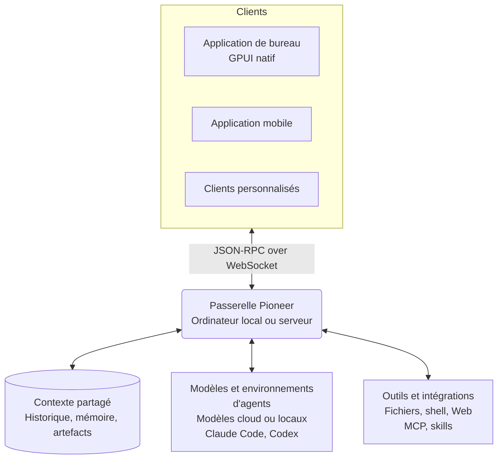

<p align="center">
  
</p>

<h1 align="center">Pioneer</h1>

<p align="center">
  Des espaces où humains et agents collaborent et s'appuient sur un contexte partagé.
</p>

<p align="center">
  <a href="https://github.com/pioneerdotai/pioneer/releases"></a>
  <a href="./LICENSE"></a>
</p>

<p align="center">
  <a href="https://github.com/pioneerdotai/pioneer/releases">Télécharger</a>
  ·
  <a href="https://docs.getpioneer.dev/getting-started/installation">Installation</a>
  ·
  <a href="https://docs.getpioneer.dev/getting-started/quickstart">Démarrage rapide</a>
  ·
  <a href="https://docs.getpioneer.dev">Documentation</a>
  ·
  <a href="https://docs.getpioneer.dev/architecture/overview">Architecture</a>
  ·
  <a href="https://docs.getpioneer.dev/protocol/introduction">Référence du protocole</a>
</p>

<p align="center">
  <a href="README.md">English</a> · <a href="README.ru.md">Русский</a> · <a href="README.de.md">Deutsch</a> · <a href="README.es.md">Español</a> · <a href="README.fr.md">Français</a> · <a href="README.hi.md">हिन्दी</a> · <a href="README.ja.md">日本語</a> · <a href="README.zh-CN.md">简体中文</a>
</p>

Dans Pioneer, les agents travaillent dans les fils où vous discutez du travail. Discutez dans un fil, confiez une tâche à un agent et examinez le résultat dans la même conversation. Utilisez Pioneer seul, en équipe ou en famille.

Utilisez les agents intégrés de Pioneer ou connectez Claude Code et Codex. Pioneer fournit le contexte et les outils aux agents et coordonne leurs tâches. Exécutez-le sur votre ordinateur ou sur un serveur que vous contrôlez.

<p align="center">
  <picture>
    <source media="(prefers-color-scheme: dark)" srcset="assets/screenshots/pioneer-main-dark.png">
    <source media="(prefers-color-scheme: light)" srcset="assets/screenshots/pioneer-main-light.png">
    
  </picture>
</p>

## Ce que vous pouvez faire

- **Enquêter ensemble sur un bug.** Partagez une erreur dans un fil d'équipe. Demandez à un agent d'examiner le code et les journaux, puis passez en revue ensemble le correctif proposé.
- **Préparer un lancement.** Discutez du public visé et des contraintes. Demandez à un agent d'étudier les concurrents ou de rédiger des textes, puis donnez-lui vos retours.
- **Revenir sur une décision.** Demandez pourquoi vous avez retenu une approche. Un agent peut rechercher les échanges précédents et s'appuyer sur les messages pertinents et les fichiers associés pour répondre.
- **Organiser des projets en famille.** Discutez d'un voyage avec votre famille et demandez à un agent de comparer les options selon vos préférences enregistrées.

## Fonctionnalités

| Fonctionnalité | Ce qu'elle permet |
| --- | --- |
| **Espaces de travail et fils** | Séparez les projets et les groupes. Invitez des personnes, échangez des messages et gérez l'accès aux espaces de travail et aux fils privés. |
| **Agents et délégation** | Configurez des agents nommés, exécutez des tâches en arrière-plan et laissez les agents déléguer du travail à des sous-agents. Suivez la progression et demandez des révisions. |
| **Modèles et environnements d'exécution** | Utilisez Anthropic, OpenAI, Gemini, OpenRouter, Ollama ou un endpoint compatible avec OpenAI. Connectez Claude Code ou Codex sur la machine qui héberge la passerelle. |
| **Outils et skills** | Travaillez avec des fichiers, des commandes shell et le Web. Connectez des services via [MCP](https://docs.getpioneer.dev/mcp/overview) et ajoutez des instructions réutilisables avec les [skills](https://docs.getpioneer.dev/skills/overview). |
| **Tâches planifiées** | Configurez des tâches ponctuelles ou récurrentes et recevez les résultats dans un fil ou dans la boîte de réception des tâches. |
| **Autorisations** | Choisissez [Supervised, Auto-accept edits ou Full access](https://docs.getpioneer.dev/getting-started/permissions). La passerelle applique les règles d'accès et les politiques d'approbation des outils. |

## S'appuyer sur un contexte partagé

La tâche suivante peut utiliser ce que vous avez établi lors de la précédente. Pioneer indexe l'historique des conversations, mémorise certains faits et décisions et conserve les liens entre les fichiers et les tâches qui les ont produits.

Les agents récupèrent le contexte pertinent en respectant les droits d'accès des espaces de travail et des fils, ainsi que le budget de contexte. L'historique et la mémoire restent dans Pioneer, indépendamment du fournisseur de modèles.

[Mémoire](https://docs.getpioneer.dev/desktop/memory) · [Récupération du contexte](https://docs.getpioneer.dev/architecture/thread-episodic-context) · [Collaboration](https://docs.getpioneer.dev/desktop/account-and-collaboration)

## Premiers pas

[Téléchargez Pioneer](https://github.com/pioneerdotai/pioneer/releases) pour macOS, Windows ou Linux.

1. Ouvrez l'application et démarrez la passerelle locale lorsque vous y êtes invité, ou connectez-vous à une passerelle existante.
2. Choisissez un espace de travail et connectez un fournisseur de modèles ou un environnement d'exécution d'agents pris en charge.
3. Créez un fil. Invitez d'autres personnes lorsque vous souhaitez travailler ensemble.

[Démarrage rapide](https://docs.getpioneer.dev/getting-started/quickstart) · [Installation d'une passerelle distante](https://docs.getpioneer.dev/getting-started/installation)

## Fonctionnement technique

Pioneer est un workspace Rust avec une application de bureau native GPUI et une passerelle utilisant SQLite. Les clients se connectent via une API JSON-RPC sur WebSocket.



La passerelle gère l'état et exécute les appels aux modèles, les environnements CLI, les outils et les tâches planifiées. Une passerelle distante utilise les fichiers et l'environnement d'exécution de la machine qui l'héberge. Une application de bureau peut se connecter à plusieurs passerelles.

[Architecture](https://docs.getpioneer.dev/architecture/overview) · [Protocole](https://docs.getpioneer.dev/protocol/introduction) · [Fournisseurs](https://docs.getpioneer.dev/providers/overview)

## Compiler depuis les sources

Installez Rust avec [rustup](https://rustup.rs). Consultez [rust-toolchain.toml](./rust-toolchain.toml) pour la chaîne d'outils et le [guide de contribution](https://docs.getpioneer.dev/contributing) pour les dépendances propres à chaque plateforme.

```bash
git clone https://github.com/pioneerdotai/pioneer.git
cd pioneer
cargo build --workspace
```

Exécutez ces commandes dans des terminaux séparés :

```bash
cargo run -p pioneer-gateway
cargo run -p pioneer-desktop --bin pioneer-app
```

Les rapports de bugs et les pull requests sont les bienvenus. La [documentation](https://docs.getpioneer.dev) couvre le guide utilisateur, la configuration et l'architecture.

Pioneer est en développement actif ; certains flux de travail restent incomplets et les API peuvent changer.

[Licence MIT](./LICENSE)
