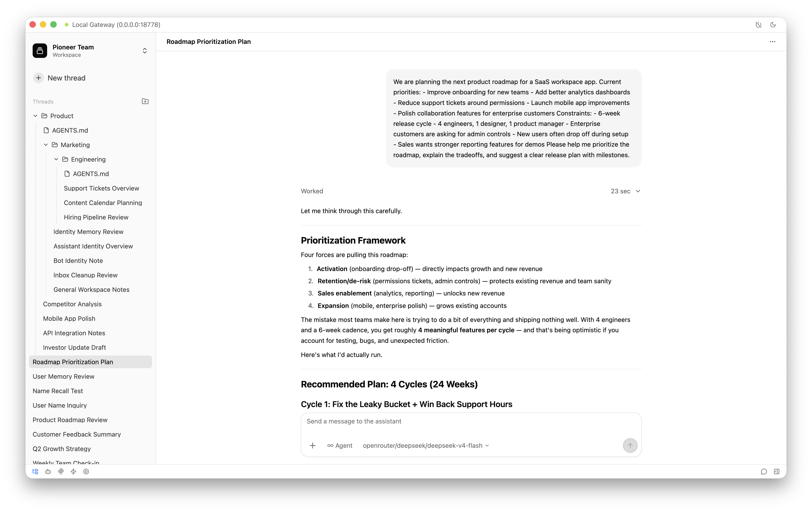
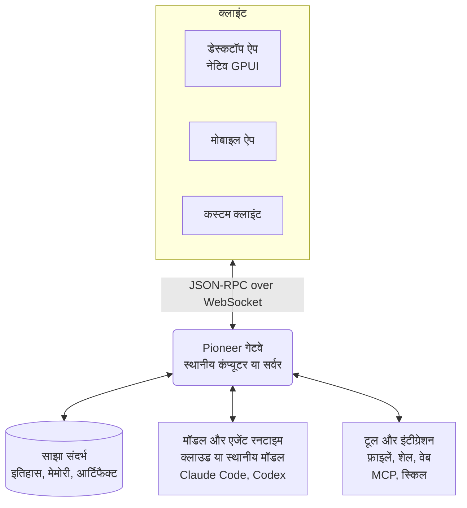

<p align="center">
  
</p>

<h1 align="center">Pioneer</h1>

<p align="center">
  ऐसे स्पेस जहाँ लोग और एजेंट मिलकर काम करते हैं और साझा संदर्भ के आधार पर आगे बढ़ते हैं।
</p>

<p align="center">
  <a href="https://github.com/pioneerdotai/pioneer/releases"></a>
  <a href="./LICENSE"></a>
</p>

<p align="center">
  <a href="https://github.com/pioneerdotai/pioneer/releases">डाउनलोड</a>
  ·
  <a href="https://docs.getpioneer.dev/getting-started/installation">इंस्टॉलेशन</a>
  ·
  <a href="https://docs.getpioneer.dev/getting-started/quickstart">त्वरित शुरुआत</a>
  ·
  <a href="https://docs.getpioneer.dev">दस्तावेज़</a>
  ·
  <a href="https://docs.getpioneer.dev/architecture/overview">आर्किटेक्चर</a>
  ·
  <a href="https://docs.getpioneer.dev/protocol/introduction">प्रोटोकॉल संदर्भ</a>
</p>

<p align="center">
  <a href="README.md">English</a> · <a href="README.ru.md">Русский</a> · <a href="README.de.md">Deutsch</a> · <a href="README.es.md">Español</a> · <a href="README.fr.md">Français</a> · <a href="README.hi.md">हिन्दी</a> · <a href="README.ja.md">日本語</a> · <a href="README.zh-CN.md">简体中文</a>
</p>

Pioneer में एजेंट उसी जगह काम करते हैं जहाँ आप काम के बारे में चर्चा करते हैं। किसी थ्रेड में बातचीत करें, एजेंट को काम सौंपें और उसी बातचीत में उसका परिणाम देखें। इसे अकेले, टीम के साथ या परिवार के साथ इस्तेमाल करें।

Pioneer के बिल्ट-इन एजेंट इस्तेमाल करें या Claude Code और Codex को जोड़ें। Pioneer एजेंटों को संदर्भ और टूल देता है और उनके काम का समन्वय करता है। इसे अपने कंप्यूटर या अपने नियंत्रण वाले सर्वर पर चलाएँ।

<p align="center">
  <picture>
    <source media="(prefers-color-scheme: dark)" srcset="assets/screenshots/pioneer-main-dark.png">
    <source media="(prefers-color-scheme: light)" srcset="assets/screenshots/pioneer-main-light.png">
    
  </picture>
</p>

## आप क्या कर सकते हैं

- **मिलकर किसी बग की जाँच करें।** टीम के थ्रेड में त्रुटि साझा करें। एजेंट से कोड और लॉग की जाँच करने को कहें, फिर सुझाए गए सुधार की साथ मिलकर समीक्षा करें।
- **लॉन्च की तैयारी करें।** लक्षित दर्शकों और सीमाओं पर चर्चा करें। एजेंट से प्रतिस्पर्धियों पर शोध करवाएँ या सामग्री का मसौदा बनवाएँ, फिर अपनी प्रतिक्रिया दें।
- **पुराने निर्णय को समझें।** पूछें कि आपने कोई तरीका क्यों चुना था। एजेंट पिछली चर्चाओं में खोजकर संबंधित संदेशों और उनसे जुड़ी फ़ाइलों के आधार पर जवाब दे सकता है।
- **परिवार के साथ योजनाएँ बनाएँ।** परिवार के साथ यात्रा पर चर्चा करें और एजेंट से आपकी सहेजी गई पसंद के आधार पर विकल्पों की तुलना करने को कहें।

## सुविधाएँ

| सुविधा | इससे क्या कर सकते हैं |
| --- | --- |
| **वर्कस्पेस और थ्रेड** | प्रोजेक्ट और समूह अलग रखें। लोगों को आमंत्रित करें, संदेश भेजें और वर्कस्पेस तथा निजी थ्रेड तक पहुँच नियंत्रित करें। |
| **एजेंट और काम सौंपना** | एजेंटों के नाम और सेटिंग तय करें और काम बैकग्राउंड में चलाएँ। एजेंट काम सबएजेंटों को सौंप सकते हैं। प्रगति देखें और संशोधन माँगें। |
| **मॉडल और रनटाइम** | Anthropic, OpenAI, Gemini, OpenRouter, Ollama या OpenAI-संगत एंडपॉइंट इस्तेमाल करें। गेटवे वाले कंप्यूटर पर Claude Code या Codex जोड़ें। |
| **टूल और स्किल** | फ़ाइलों, शेल कमांड और वेब के साथ काम करें। [MCP](https://docs.getpioneer.dev/mcp/overview) के ज़रिए सेवाएँ जोड़ें और [स्किल](https://docs.getpioneer.dev/skills/overview) के ज़रिए दोबारा इस्तेमाल किए जा सकने वाले निर्देश दें। |
| **तय समय पर काम** | एक बार या बार-बार चलने वाले काम तय करें और परिणाम किसी थ्रेड या टास्क इनबॉक्स में पाएँ। |
| **अनुमतियाँ** | [Supervised, Auto-accept edits या Full access](https://docs.getpioneer.dev/getting-started/permissions) चुनें। गेटवे पहुँच के नियम और टूल की मंज़ूरी की नीतियाँ लागू करता है। |

## साझा संदर्भ के आधार पर आगे बढ़ें

अगला काम पिछले काम में निकले निष्कर्षों का इस्तेमाल कर सकता है। Pioneer बातचीत का इतिहास इंडेक्स करता है, चुने हुए तथ्य और निर्णय याद रखता है और फ़ाइलों को उन कामों से जोड़कर रखता है जिनसे वे बनी थीं।

एजेंट वर्कस्पेस और थ्रेड की अनुमतियों का पालन करते हुए, तय संदर्भ सीमा के भीतर ज़रूरी जानकारी खोजते हैं। इतिहास और मेमोरी Pioneer में रहते हैं, आपके मॉडल प्रदाता से स्वतंत्र।

[मेमोरी](https://docs.getpioneer.dev/desktop/memory) · [संदर्भ प्राप्त करना](https://docs.getpioneer.dev/architecture/thread-episodic-context) · [सहयोग](https://docs.getpioneer.dev/desktop/account-and-collaboration)

## शुरू करें

macOS, Windows या Linux के लिए [Pioneer डाउनलोड करें](https://github.com/pioneerdotai/pioneer/releases)।

1. ऐप खोलें और संकेत मिलने पर स्थानीय गेटवे शुरू करें, या मौजूदा गेटवे से जुड़ें।
2. वर्कस्पेस चुनें और मॉडल प्रदाता या समर्थित एजेंट रनटाइम जोड़ें।
3. थ्रेड शुरू करें। साथ काम करना चाहें तो दूसरे लोगों को आमंत्रित करें।

[त्वरित शुरुआत](https://docs.getpioneer.dev/getting-started/quickstart) · [रिमोट गेटवे की इंस्टॉलेशन](https://docs.getpioneer.dev/getting-started/installation)

## तकनीकी ढाँचा

Pioneer एक Rust वर्कस्पेस है जिसमें नेटिव GPUI डेस्कटॉप ऐप और SQLite पर आधारित गेटवे है। क्लाइंट WebSocket के ज़रिए JSON-RPC API से जुड़ते हैं।



गेटवे स्टेट संभालता है और मॉडल कॉल, CLI रनटाइम, टूल और तय समय वाले काम चलाता है। रिमोट गेटवे उस कंप्यूटर की फ़ाइलें और रनटाइम परिवेश इस्तेमाल करता है जिस पर वह चलता है। एक डेस्कटॉप ऐप कई गेटवे से जुड़ सकता है।

[आर्किटेक्चर](https://docs.getpioneer.dev/architecture/overview) · [प्रोटोकॉल](https://docs.getpioneer.dev/protocol/introduction) · [प्रदाता](https://docs.getpioneer.dev/providers/overview)

## सोर्स कोड से बिल्ड करें

[rustup](https://rustup.rs) से Rust इंस्टॉल करें। टूलचेन के लिए [rust-toolchain.toml](./rust-toolchain.toml) और प्लेटफ़ॉर्म की निर्भरताओं के लिए [योगदान की गाइड](https://docs.getpioneer.dev/contributing) देखें।

```bash
git clone https://github.com/pioneerdotai/pioneer.git
cd pioneer
cargo build --workspace
```

इन कमांड को अलग-अलग टर्मिनल में चलाएँ:

```bash
cargo run -p pioneer-gateway
cargo run -p pioneer-desktop --bin pioneer-app
```

बग रिपोर्ट और पुल रिक्वेस्ट का स्वागत है। [दस्तावेज़ों](https://docs.getpioneer.dev) में उपयोगकर्ता गाइड, कॉन्फ़िगरेशन और आर्किटेक्चर शामिल हैं।

Pioneer का विकास जारी है; कुछ प्रक्रियाएँ अभी अधूरी हैं और API बदल सकते हैं।

[MIT लाइसेंस](./LICENSE)
