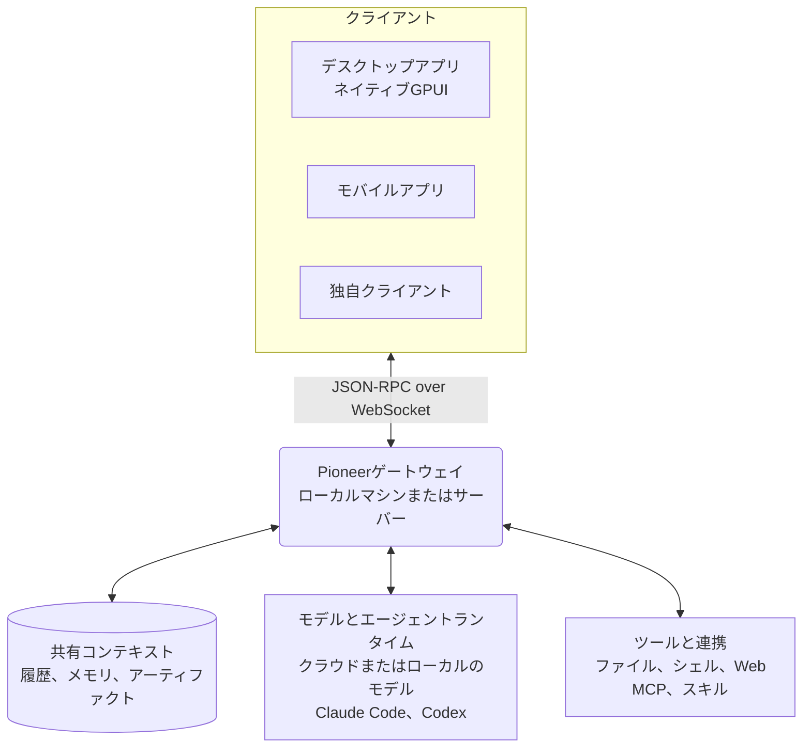

<p align="center">
  
</p>

<h1 align="center">Pioneer</h1>

<p align="center">
  人とエージェントが協力し、共有コンテキストを土台に作業を進めるスペース。
</p>

<p align="center">
  <a href="https://github.com/pioneerdotai/pioneer/releases"></a>
  <a href="./LICENSE"></a>
</p>

<p align="center">
  <a href="https://github.com/pioneerdotai/pioneer/releases">ダウンロード</a>
  ·
  <a href="https://docs.getpioneer.dev/getting-started/installation">インストール</a>
  ·
  <a href="https://docs.getpioneer.dev/getting-started/quickstart">クイックスタート</a>
  ·
  <a href="https://docs.getpioneer.dev">ドキュメント</a>
  ·
  <a href="https://docs.getpioneer.dev/architecture/overview">アーキテクチャ</a>
  ·
  <a href="https://docs.getpioneer.dev/protocol/introduction">プロトコルリファレンス</a>
</p>

<p align="center">
  <a href="README.md">English</a> · <a href="README.ru.md">Русский</a> · <a href="README.de.md">Deutsch</a> · <a href="README.es.md">Español</a> · <a href="README.fr.md">Français</a> · <a href="README.hi.md">हिन्दी</a> · <a href="README.ja.md">日本語</a> · <a href="README.zh-CN.md">简体中文</a>
</p>

Pioneerでは、作業について話し合う場所でエージェントを動かせます。スレッドで話し合い、エージェントにタスクを任せ、その会話の中で成果を確認できます。一人でも、チームでも、家族でも使えます。

Pioneerの組み込みエージェントを使うほか、Claude CodeやCodexも接続できます。Pioneerはコンテキストとツールを提供し、エージェントのタスクを調整します。自分のコンピューターや管理下のサーバーで実行できます。

<p align="center">
  <picture>
    <source media="(prefers-color-scheme: dark)" srcset="assets/screenshots/pioneer-main-dark.png">
    <source media="(prefers-color-scheme: light)" srcset="assets/screenshots/pioneer-main-light.png">
    
  </picture>
</p>

## できること

- **チームでバグを調査する。** チームのスレッドでエラーを共有し、エージェントにコードとログの調査を依頼します。提案された修正を一緒に確認できます。
- **ローンチを準備する。** 想定するユーザーや制約を話し合います。エージェントに競合調査や文章の下書きを依頼し、フィードバックを返せます。
- **過去の判断を振り返る。** ある方法を選んだ理由を尋ねると、エージェントは過去の議論を検索し、関連するメッセージや紐づくファイルを使って回答できます。
- **家族で予定を立てる。** 家族と旅行について話し合い、保存した好みに合わせて選択肢を比較するよう、エージェントに依頼できます。

## 機能

| 機能 | 内容 |
| --- | --- |
| **ワークスペースとスレッド** | プロジェクトやグループを分けて管理できます。人を招待し、メッセージをやり取りし、ワークスペースや非公開スレッドへのアクセスを設定できます。 |
| **エージェントと委任** | 名前を持つエージェントを設定し、タスクをバックグラウンドで実行できます。エージェントからサブエージェントへの委任、進捗の確認、修正の依頼もできます。 |
| **モデルとランタイム** | Anthropic、OpenAI、Gemini、OpenRouter、Ollama、OpenAI互換エンドポイントを利用できます。ゲートウェイのホスト上にあるClaude CodeやCodexも接続できます。 |
| **ツールとスキル** | ファイル、シェルコマンド、Webを扱えます。[MCP](https://docs.getpioneer.dev/mcp/overview)でサービスを接続し、[スキル](https://docs.getpioneer.dev/skills/overview)で再利用可能な指示を追加できます。 |
| **タスクのスケジュール** | 単発または定期実行のタスクを設定し、スレッドやタスク受信箱で結果を受け取れます。 |
| **権限** | [Supervised、Auto-accept edits、Full access](https://docs.getpioneer.dev/getting-started/permissions)から選択できます。ゲートウェイがアクセス規則とツールの承認ポリシーを適用します。 |

## 共有コンテキストを活用する

次のタスクでは、前のタスクで分かったことを利用できます。Pioneerは会話履歴をインデックス化し、選ばれた事実や決定を記憶し、ファイルを、それを作成したタスクと紐づけて保存します。

エージェントは、ワークスペースとスレッドのアクセス権およびコンテキスト量の上限に従って、関連する情報を取得します。Pioneerは、モデルプロバイダーとは独立して履歴とメモリを保存します。

[メモリ](https://docs.getpioneer.dev/desktop/memory) · [コンテキストの取得](https://docs.getpioneer.dev/architecture/thread-episodic-context) · [共同作業](https://docs.getpioneer.dev/desktop/account-and-collaboration)

## はじめる

macOS、Windows、Linux向けの[Pioneerをダウンロード](https://github.com/pioneerdotai/pioneer/releases)してください。

1. アプリを開き、案内に従ってローカルゲートウェイを起動するか、既存のゲートウェイに接続します。
2. ワークスペースを選び、モデルプロバイダーまたは対応するエージェントランタイムを接続します。
3. スレッドを作成します。一緒に作業する場合は、ほかの人を招待します。

[クイックスタート](https://docs.getpioneer.dev/getting-started/quickstart) · [リモートゲートウェイのインストール](https://docs.getpioneer.dev/getting-started/installation)

## 技術構成

Pioneerは、ネイティブなGPUIデスクトップアプリとSQLiteを使うゲートウェイからなるRustワークスペースです。クライアントはWebSocket経由のJSON-RPC APIで接続します。



ゲートウェイは状態を管理し、モデル呼び出し、CLIランタイム、ツール、スケジュールされたタスクを実行します。リモートゲートウェイは、稼働するマシンのファイルと実行環境を使います。一つのデスクトップアプリから複数のゲートウェイに接続できます。

[アーキテクチャ](https://docs.getpioneer.dev/architecture/overview) · [プロトコル](https://docs.getpioneer.dev/protocol/introduction) · [プロバイダー](https://docs.getpioneer.dev/providers/overview)

## ソースからビルドする

[rustup](https://rustup.rs)でRustをインストールしてください。ツールチェーンは[rust-toolchain.toml](./rust-toolchain.toml)、プラットフォームごとの依存関係は[貢献ガイド](https://docs.getpioneer.dev/contributing)を参照してください。

```bash
git clone https://github.com/pioneerdotai/pioneer.git
cd pioneer
cargo build --workspace
```

次のコマンドをそれぞれ別のターミナルで実行します。

```bash
cargo run -p pioneer-gateway
cargo run -p pioneer-desktop --bin pioneer-app
```

バグ報告やプルリクエストを歓迎します。[ドキュメント](https://docs.getpioneer.dev)には、ユーザーガイド、設定、アーキテクチャの説明があります。

Pioneerは開発中です。一部の操作フローは未完成で、APIは変更される可能性があります。

[MITライセンス](./LICENSE)
