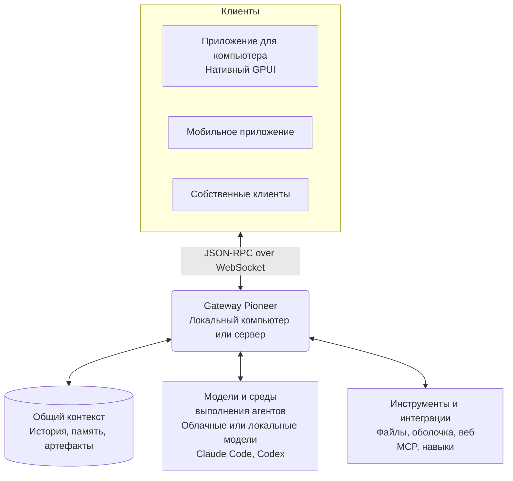

<p align="center">
  
</p>

<h1 align="center">Pioneer</h1>

<p align="center">
  Пространства, где люди и агенты сотрудничают и опираются на общий контекст.
</p>

<p align="center">
  <a href="https://github.com/pioneerdotai/pioneer/releases"></a>
  <a href="./LICENSE"></a>
</p>

<p align="center">
  <a href="https://github.com/pioneerdotai/pioneer/releases">Скачать</a>
  ·
  <a href="https://docs.getpioneer.dev/getting-started/installation">Установка</a>
  ·
  <a href="https://docs.getpioneer.dev/getting-started/quickstart">Быстрый старт</a>
  ·
  <a href="https://docs.getpioneer.dev">Документация</a>
  ·
  <a href="https://docs.getpioneer.dev/architecture/overview">Архитектура</a>
  ·
  <a href="https://docs.getpioneer.dev/protocol/introduction">Справочник протокола</a>
</p>

<p align="center">
  <a href="README.md">English</a> · <a href="README.ru.md">Русский</a> · <a href="README.de.md">Deutsch</a> · <a href="README.es.md">Español</a> · <a href="README.fr.md">Français</a> · <a href="README.hi.md">हिन्दी</a> · <a href="README.ja.md">日本語</a> · <a href="README.zh-CN.md">简体中文</a>
</p>

В Pioneer можно обсуждать работу и поручать её агентам в одной ветке. Общайтесь в ветке, поручайте агенту задачу и проверяйте результат в том же обсуждении. Работайте самостоятельно, с командой или с семьёй.

Используйте встроенных агентов Pioneer или подключите Claude Code и Codex. Pioneer даёт агентам контекст и инструменты, координирует их задачи. Запускайте его на своём компьютере или сервере под вашим управлением.

<p align="center">
  <picture>
    <source media="(prefers-color-scheme: dark)" srcset="assets/screenshots/pioneer-main-dark.png">
    <source media="(prefers-color-scheme: light)" srcset="assets/screenshots/pioneer-main-light.png">
    
  </picture>
</p>

## Что можно делать

- **Разобраться с ошибкой вместе.** Поделитесь ошибкой в командной ветке. Попросите агента изучить код и логи, затем вместе проверьте предложенное исправление.
- **Подготовить запуск.** Обсудите аудиторию и ограничения. Поручите агенту изучить конкурентов или написать текст, затем дайте обратную связь.
- **Вернуться к принятому решению.** Спросите, почему вы выбрали тот или иной подход. Агент может найти предыдущие обсуждения и использовать нужные сообщения и связанные файлы в ответе.
- **Спланировать семейные дела.** Обсудите поездку с семьёй и попросите агента сравнить варианты с учётом сохранённых предпочтений.

## Возможности

| Возможность | Что она даёт |
| --- | --- |
| **Рабочие пространства и ветки** | Разделяйте проекты и группы. Приглашайте людей, обменивайтесь сообщениями и управляйте доступом к рабочим пространствам и приватным веткам. |
| **Агенты и делегирование** | Настраивайте агентов с собственными именами, запускайте задачи в фоне и позволяйте агентам поручать работу субагентам. Следите за ходом работы и запрашивайте доработки. |
| **Модели и среды выполнения** | Используйте Anthropic, OpenAI, Gemini, OpenRouter, Ollama или API, совместимый с OpenAI. Подключайте Claude Code или Codex на машине, где работает gateway. |
| **Инструменты и навыки** | Работайте с файлами, командами оболочки и вебом. Подключайте сервисы через [MCP](https://docs.getpioneer.dev/mcp/overview) и добавляйте повторно используемые инструкции через [навыки](https://docs.getpioneer.dev/skills/overview). |
| **Работа по расписанию** | Настраивайте разовые или повторяющиеся задачи и получайте результаты в ветке или в разделе входящих задач. |
| **Разрешения** | Выбирайте [Supervised, Auto-accept edits или Full access](https://docs.getpioneer.dev/getting-started/permissions). Gateway применяет правила доступа и подтверждения действий инструментов. |

## Опирайтесь на общий контекст

Следующая задача может использовать то, что вы выяснили в предыдущей. Pioneer индексирует историю обсуждений, запоминает выбранные факты и решения и сохраняет связь файлов с задачами, в которых они появились.

Агенты находят нужный контекст в пределах доступных им рабочих пространств и веток. Объём контекста ограничен заданным лимитом. История и память хранятся в Pioneer независимо от провайдера моделей.

[Память](https://docs.getpioneer.dev/desktop/memory) · [Поиск контекста](https://docs.getpioneer.dev/architecture/thread-episodic-context) · [Совместная работа](https://docs.getpioneer.dev/desktop/account-and-collaboration)

## Начало работы

[Скачайте Pioneer](https://github.com/pioneerdotai/pioneer/releases) для macOS, Windows или Linux.

1. Откройте приложение и запустите локальный gateway, когда появится запрос, или подключитесь к существующему.
2. Выберите рабочее пространство и подключите провайдера моделей или поддерживаемую среду выполнения агента.
3. Создайте ветку. Пригласите других людей, если хотите работать вместе.

[Быстрый старт](https://docs.getpioneer.dev/getting-started/quickstart) · [Установка удалённого gateway](https://docs.getpioneer.dev/getting-started/installation)

## Как всё устроено

Pioneer организован как Rust workspace и включает нативное приложение на GPUI и gateway с базой SQLite. Клиенты подключаются через JSON-RPC API по WebSocket.



Gateway хранит состояние и выполняет вызовы моделей, запускает CLI-среды выполнения, инструменты и задачи по расписанию. Удалённый gateway использует файлы и среду выполнения той машины, на которой работает. Одно приложение для компьютера может подключаться к нескольким gateway.

[Архитектура](https://docs.getpioneer.dev/architecture/overview) · [Протокол](https://docs.getpioneer.dev/protocol/introduction) · [Провайдеры](https://docs.getpioneer.dev/providers/overview)

## Сборка из исходников

Установите Rust через [rustup](https://rustup.rs). Набор инструментов указан в [rust-toolchain.toml](./rust-toolchain.toml). Зависимости для разных платформ описаны в [руководстве для участников](https://docs.getpioneer.dev/contributing).

```bash
git clone https://github.com/pioneerdotai/pioneer.git
cd pioneer
cargo build --workspace
```

Запустите эти команды в отдельных терминалах:

```bash
cargo run -p pioneer-gateway
cargo run -p pioneer-desktop --bin pioneer-app
```

Присылайте сообщения об ошибках и pull request. В [документации](https://docs.getpioneer.dev) описаны работа с приложением, настройка и архитектура.

Pioneer активно разрабатывается: некоторые сценарии ещё не завершены, а API могут меняться.

[Лицензия MIT](./LICENSE)
