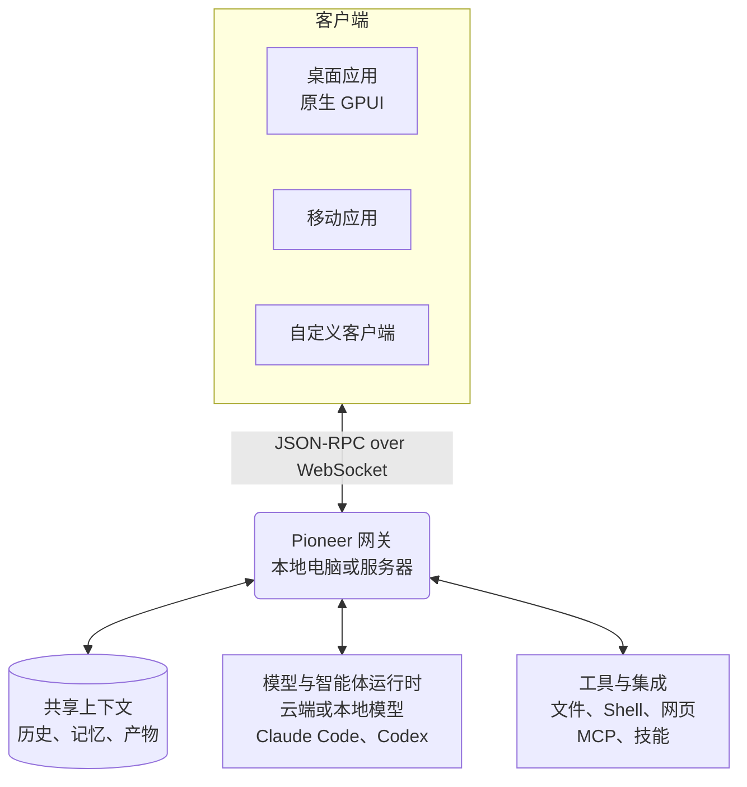

<p align="center">
  
</p>

<h1 align="center">Pioneer</h1>

<p align="center">
  人与智能体协作，并基于共享上下文推进工作的空间。
</p>

<p align="center">
  <a href="https://github.com/pioneerdotai/pioneer/releases"></a>
  <a href="./LICENSE"></a>
</p>

<p align="center">
  <a href="https://github.com/pioneerdotai/pioneer/releases">下载</a>
  ·
  <a href="https://docs.getpioneer.dev/getting-started/installation">安装</a>
  ·
  <a href="https://docs.getpioneer.dev/getting-started/quickstart">快速上手</a>
  ·
  <a href="https://docs.getpioneer.dev">文档</a>
  ·
  <a href="https://docs.getpioneer.dev/architecture/overview">架构</a>
  ·
  <a href="https://docs.getpioneer.dev/protocol/introduction">协议参考</a>
</p>

<p align="center">
  <a href="README.md">English</a> · <a href="README.ru.md">Русский</a> · <a href="README.de.md">Deutsch</a> · <a href="README.es.md">Español</a> · <a href="README.fr.md">Français</a> · <a href="README.hi.md">हिन्दी</a> · <a href="README.ja.md">日本語</a> · <a href="README.zh-CN.md">简体中文</a>
</p>

在 Pioneer 中，你可以在讨论工作的同一个会话里使用智能体。交流、分配任务和查看结果都在这个会话中进行。你可以独自使用，也可以与团队或家人一起使用。

使用 Pioneer 内置的智能体，或接入 Claude Code 和 Codex。Pioneer 提供上下文和工具，并协调智能体的任务。你可以在自己的电脑或由你管理的服务器上运行它。

<p align="center">
  <picture>
    <source media="(prefers-color-scheme: dark)" srcset="assets/screenshots/pioneer-main-dark.png">
    <source media="(prefers-color-scheme: light)" srcset="assets/screenshots/pioneer-main-light.png">
    
  </picture>
</p>

## 你可以做什么

- **一起排查错误。** 在团队会话中分享错误，让智能体检查代码和日志，再一起审查它提出的修复方案。
- **准备产品发布。** 讨论目标受众和限制条件，让智能体研究竞品或起草文案，再给出反馈。
- **回顾以前的决策。** 询问当时为什么选择某个方案。智能体可以搜索之前的讨论，并根据相关消息和关联文件作答。
- **安排家庭事务。** 与家人讨论旅行计划，让智能体根据已保存的偏好比较不同选项。

## 功能

| 功能 | 用途 |
| --- | --- |
| **工作区与会话** | 将不同项目和群组分开管理。邀请成员、交流消息，并控制工作区和私密会话的访问权限。 |
| **智能体与任务委派** | 设置智能体的名称和配置，在后台运行任务，并让智能体将工作委派给子智能体。查看进度并要求修改。 |
| **模型与运行时** | 使用 Anthropic、OpenAI、Gemini、OpenRouter、Ollama 或兼容 OpenAI 的端点。在网关所在机器上接入 Claude Code 或 Codex。 |
| **工具与技能** | 处理文件、运行 Shell 命令并访问网页。通过 [MCP](https://docs.getpioneer.dev/mcp/overview) 连接服务，通过[技能](https://docs.getpioneer.dev/skills/overview)添加可重复使用的指令。 |
| **定时任务** | 设置一次性或周期性任务，在会话或任务收件箱中接收结果。 |
| **权限** | 选择 [Supervised、Auto-accept edits 或 Full access](https://docs.getpioneer.dev/getting-started/permissions)。网关执行访问规则和工具审批策略。 |

## 基于共享上下文继续工作

下一项任务可以利用上一项任务中得出的结论。Pioneer 为会话历史建立索引，记住选定的事实和决策，并保留文件与生成这些文件的任务之间的关联。

智能体检索相关内容时，会遵守工作区和会话的访问权限及上下文用量限制。历史和记忆存储在 Pioneer 中，不依赖你选择的模型提供商。

[记忆](https://docs.getpioneer.dev/desktop/memory) · [上下文检索](https://docs.getpioneer.dev/architecture/thread-episodic-context) · [协作](https://docs.getpioneer.dev/desktop/account-and-collaboration)

## 开始使用

[下载 Pioneer](https://github.com/pioneerdotai/pioneer/releases)，支持 macOS、Windows 和 Linux。

1. 打开应用，按提示启动本地网关，或连接已有网关。
2. 选择工作区，接入模型提供商或受支持的智能体运行时。
3. 创建会话。需要一起工作时，邀请其他人加入。

[快速上手](https://docs.getpioneer.dev/getting-started/quickstart) · [安装远程网关](https://docs.getpioneer.dev/getting-started/installation)

## 技术结构

Pioneer 是一个 Rust workspace，包含基于 GPUI 的原生桌面应用和使用 SQLite 的网关。客户端通过 WebSocket 上的 JSON-RPC API 连接。



网关管理状态，并执行模型调用、CLI 运行时、工具和定时任务。远程网关使用所在机器的文件和执行环境。一个桌面应用可以连接多个网关。

[架构](https://docs.getpioneer.dev/architecture/overview) · [协议](https://docs.getpioneer.dev/protocol/introduction) · [提供商](https://docs.getpioneer.dev/providers/overview)

## 从源码构建

通过 [rustup](https://rustup.rs) 安装 Rust。工具链配置见 [rust-toolchain.toml](./rust-toolchain.toml)，各平台的依赖见[贡献指南](https://docs.getpioneer.dev/contributing)。

```bash
git clone https://github.com/pioneerdotai/pioneer.git
cd pioneer
cargo build --workspace
```

在不同的终端中分别运行以下命令：

```bash
cargo run -p pioneer-gateway
cargo run -p pioneer-desktop --bin pioneer-app
```

欢迎提交错误报告和 pull request。[文档](https://docs.getpioneer.dev)包含用户指南、配置和架构说明。

Pioneer 仍在开发中，部分流程尚未完成，API 也可能变化。

[MIT 许可证](./LICENSE)
